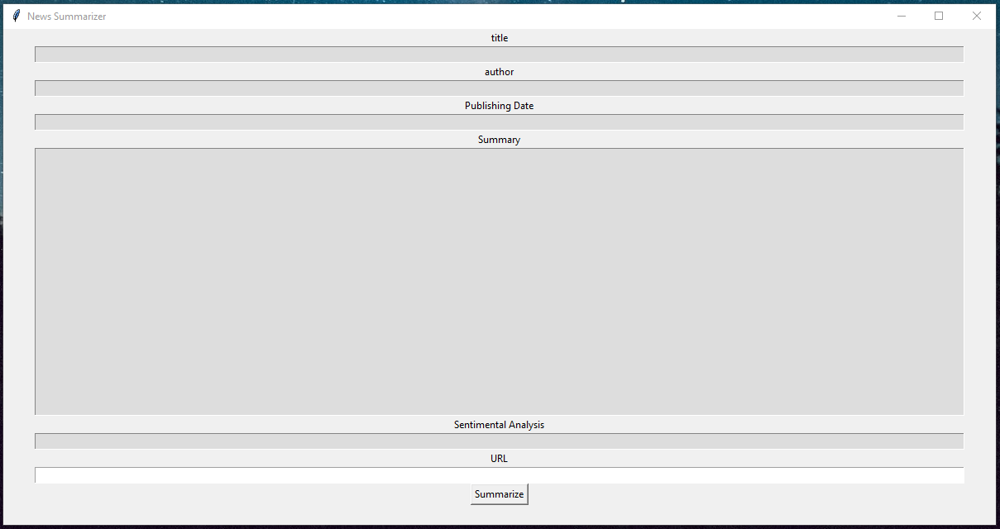

<h1 style="text-align:center">🏆 News Summarize </h1>
<p>News Summarize is a project using <bold>Natural Language Processing</bold> and <bold>Sentiment Analysis</bold>through mixing the <a href="https://newspaper.readthedocs.io/en/latest/">newspaper</a>, <a href="https://www.nltk.org/index.html">nltk </a> and <a href="https://textblob.readthedocs.io/en/dev/quickstart.html">textblob</a> libraries.</p>
<br>
<hr>
<h2>📝 Features</h2>
<ul>
    <li>Get the Title, Author, Publish Date and Summary of a News.</li>
    <li>Get insights about the text sentiments.</li>
</ul>
<h2>🎞 Demo</h2>

<h2>🎮Tech Stack</h2>
<ul>
    <li>Python - Language</li>
    <li>Tkinter - UI Library</li>
    <li>Newspaper - Scrapping Library</li>
    <li>NLTK - Natural Language ToolKit Library</li>
    <li>Textblob - Sentiment Analysis Library</li>
</ul>
<h2>🛠 Getting Started</h2>

<h3>Prerequisites</h3>

<p>Here's what you need to be able to run News Summarize</p>
<ul>
    <li>Python 3.x</li>
</ul>

<h3>1. Clone the repository</h3>

```shell
git clone https://github.com/PedroPaulino/MLPy-SummarizeNews.git

```

<h3>2. Install pip dependencies</h3>

```shell
python -m pip install tkinter
python -m pip install nltk
python -m pip install textblob
python -m pip install newspaper3k

```

<h3>3. Initialize the app</h3>

```shell
python main.py

```